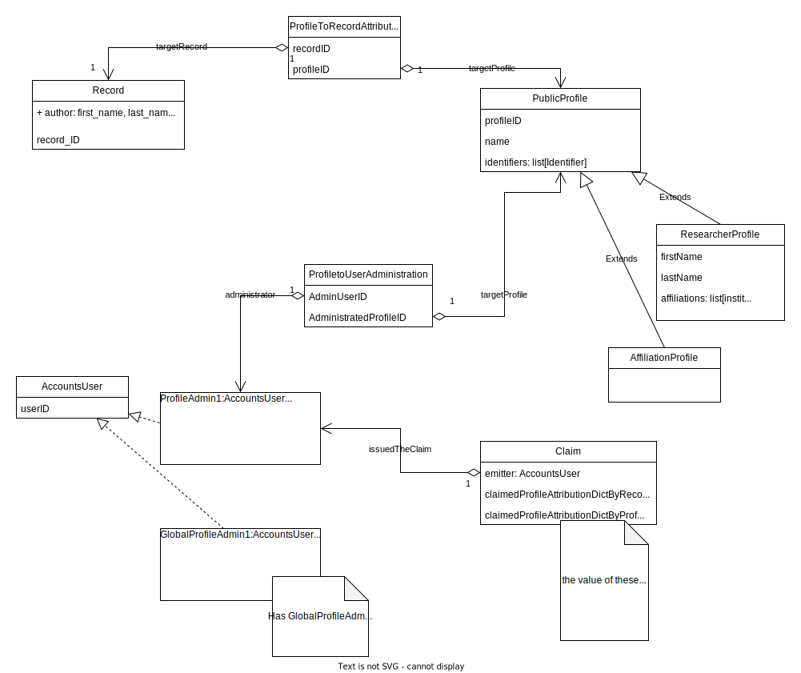
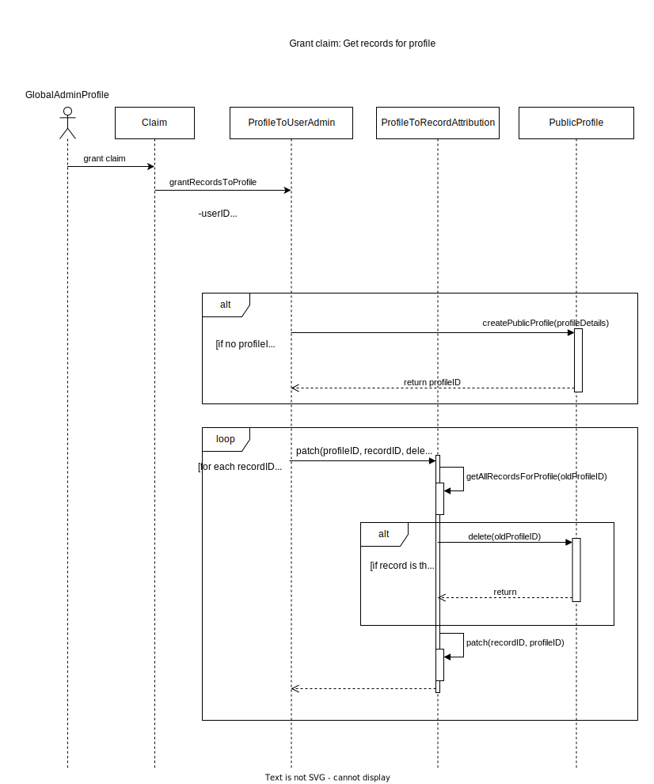
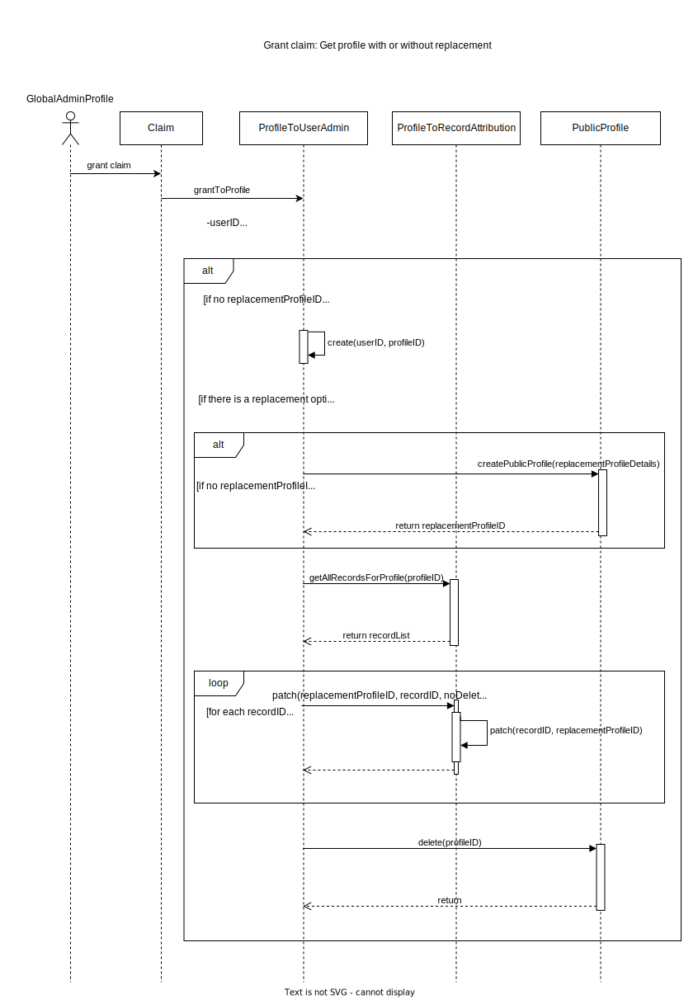
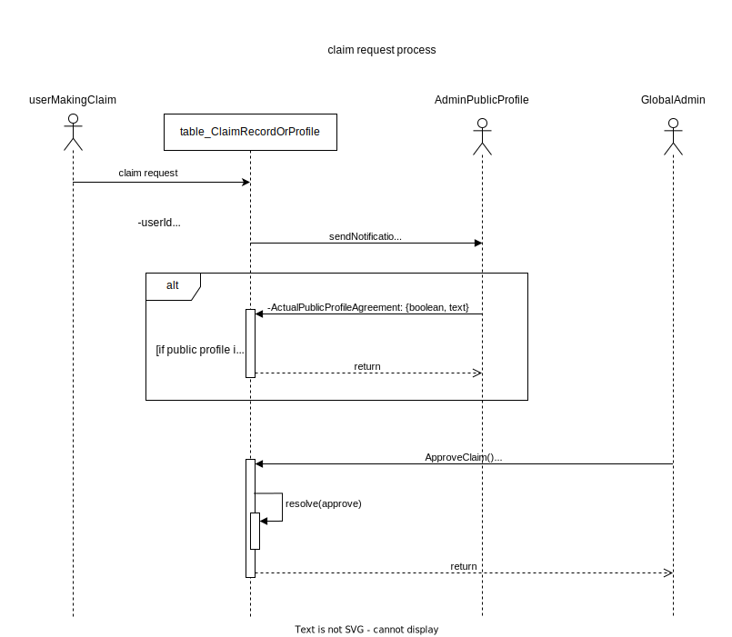
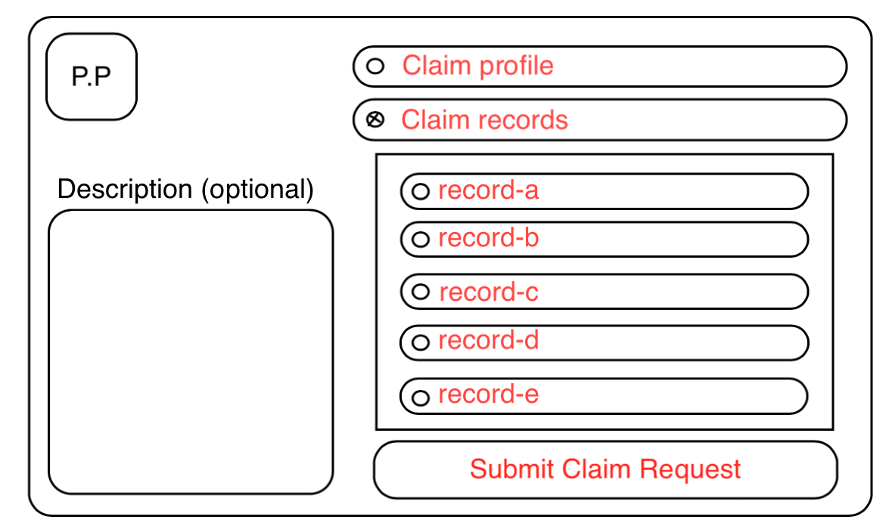
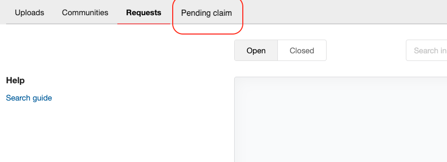

## Class diagram

Creation of public profiles for all records based on name and surname. Each user can claim a public profile to which records are associated. During a claim, the user is assigned the complete profile or certain records with automatic creation of a public profile using their name and surname.

The relationship between users and public profiles is established through the ProfileUserAdministration table, and the relationships between records and public profiles are managed through the ProfileToRecordAttribution table.



## User claims one or more records

If a user claims one or more records and the request is approved by an admin, a claim request is generated (inserting the request into the claim table) with :

- ID of the user who do a claim request.
- List of the claimed records.
- ID of the public profile who will receive the records.
- Details of public profile who will receive the records.

If there is no ID on the public profile receiving the records, then we create it using the data from the public profile, such as name and surname.

And for all the records in the list, we will update the ProfileToRecordAttribution table by updating the ID of the public profile with the new one. If the old public profile no longer has any associated records, then it is deleted.




## User claims public profile

If a user claims a public profile and the request is approved by an admin, a claim request is generated (inserting the request into the claim table) with :

- ID of the user who do a claim request.
- ID of the public profile who will receive the records.
- Details of public profile who will receive the records.
- ID of the target public profile.

If there is no ID on the public profile receiving the records, then we create it using the data from the public profile, such as name and surname.

And for all the records associate on the target public profile, we will update the ProfileToRecordAttribution table by updating the ID of the public profile with the new one. then deleting the old public profile.



## Claiming system

A claim request records in the database the user's ID making the request, the ID of the public profile that will receive the data, the ID of the target public profile, and a list of records and the profile of the one who should receive the data.



Creation of a "claim" button for records (provided the user is logged in), leading to a form page where one can choose to claim the profile, a single record, or multiple records. Additionally, include a description field for the administrator.


Here is a simple ui of the page for claiming profiles and records.



Here is a speculation about what the claims table could potentially be like. The concept is to include the user's ID making the request, a list of the records they want, and if they desire the profile, indicating the profile's ID. Entering the profile ID will signify that all associated records should be transferred to them. The description is optional and can be used for the administrator's validation.


Creation of a page for visualizing ongoing claim requests page.
In the requests, add the "Pending Claims" tab, which will be a table containing all pending claim requests.



#### Script SQL for creating the 'claim' table with its columns.

```sql
CREATE TABLE claim_record_or_profile (
    id INT PRIMARY KEY AUTO_INCREMENT,
    user_id VARCHAR(255),
    claimed_records VARCHAR(255)[],
    claimed_profile_id VARCHAR(255),
    description VARCHAR(255)
);
```

TODO:

- make a UI to select a public profile who will receive the record/public profile.
- create form page
- how to create table for BDD
