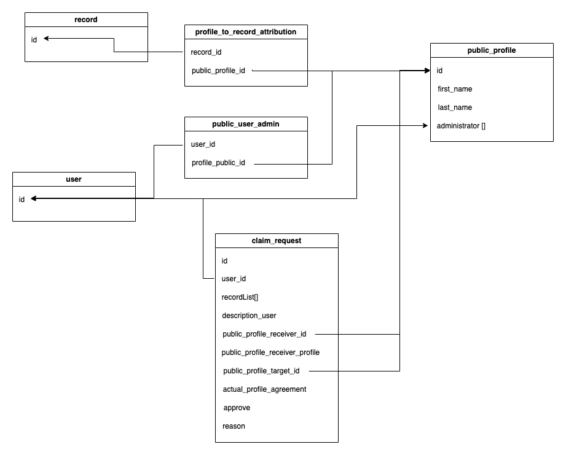

## Définitions :
| Nom | Description |
| --- | --- |
| user | Utilisateur d'Invenio |
| adminProfilePublic | Utilisateur associé à un profil public |
| globalAdmin | Utilisateur autorisé à valider ou rejeter les demandes de claim |
| claim | Demande d'un utilisateur pour l'attribution d'un profile ou de record(s) |

---

## Création de Profils Publics

La création de profils publics est automatisée pour tous les records en se basant sur le nom et le prénom.

Chaque utilisateur a la possibilité de revendiquer un profil public, auquel des records sont associés, ou simplement un ou plusieurs records de ce profil.

Lorsqu'une demande (claim) est approuvée par un globalAdmin, l'utilisateur se voit attribuer les données demandées (le profil, un ou plusieurs records).

La relation entre les utilisateurs et les profils publics est établie par la table `ProfileUserAdministration`, tandis que les relations entre les enregistrements et les profils publics sont établies par la table `ProfileToRecordAttribution`.

Création d'une page de formulaire pour la génération des demandes de claim. 

---

## Class diagram

---
## Claim Request Generation Process

When a user claims one or more records and the request is approved by an admin, a claim request is generated. This involves inserting the request into the claim table with the following details:

- ID of the user making the claim request.
- List of claimed records.
- ID of the public profile that will receive the records.
- Details of the public profile that will receive the records.

If there is no ID for the public profile receiving the records, one is created using data from the public profile, such as name and surname. 

Subsequently, for all records in the list, the `ProfileToRecordAttribution` table is updated by replacing the old public profile ID with the new one. If the old public profile no longer has any associated records, it is then deleted.

---

## User Claims Public Profile

When a user claims a public profile and the request is approved by an admin, a claim request is generated by inserting the request into the claim table. The request includes:

- ID of the user making the claim request.
- ID of the public profile that will receive the records.
- Details of the public profile that will receive the records.
- ID of the target public profile.

If there is no ID for the public profile receiving the records, it is created using data from the public profile, such as name and surname.

Subsequently, for all records associated with the target public profile, the `ProfileToRecordAttribution` table is updated by replacing the old public profile ID with the new one. The old public profile is then deleted.

---

## Claiming system

Lorsqu'une demande de réclamation est effectuée, elle est enregistrée dans la base de données avec les informations suivantes :

- Identifiant de l'utilisateur effectuant la demande.
- Identifiant du profil public qui recevra les données.
- Identifiant du profil public cible.
- Liste d'enregistrements.
- Profil de la personne devant recevoir les données.

## Informations d'une Demande d'Attribution

Une demande d'attribution est enregistrée dans la base de données avec les informations suivantes :

| Colonne | Données |
|---|---|
| user_id | ID du compte Invenio de l'utilisateur faisant la demande |
| recordList[] | Liste de records réclamés par l'utilisateur (user_id) |
| description_user | Justification de l'attribution de ce profil ou de ces enregistrements au profil public destinataire, en option. |
| public_profile_receiver_id | ID du profil public recevant les données |
| public_profile_receiver_profile | Informations complètes du profil public recevant les données |
| public_profile_target | ID du profil public auquel on souhaite retirer les données |
| actualProfileProfileAgreement | JSON -> Indique si le profil public cible est d'accord pour la nouvelle attribution des enregistrements, avec la possibilité d'inclure un message. |
| approve | BOOLEAN -> La demande de revendication a-t-elle été acceptée par l'administrateur global ? |
| reasonOfApprove | JSON -> En cas de refus, l'administrateur global doit expliquer la raison. |

Creation of a "Claim" button for records, accessible only when the user is logged in. This button will direct users to a form page where they can choose to claim either a single profile or multiple records. Additionally, the form should incorporate a description field to assist the administrator in making decision.

Here is a basic UI for the page dedicated to claiming profiles and records.

Creation of a page for visualizing ongoing claim requests. Within the requests section, include a "Pending Claims" tab that comprises a table displaying all pending claim requests.

# Schéma database:

# Questions/TODO:

- Page formulaire de claim, dans la barre de search, s'il n'y a pas de profil public, proposons-nous un bouton de création du profil public ? Comment lier ce profil public à un user ?
- Page formulaire de claim, dans la barre de search, si un profil public existe, comment déterminer s'il correspond au bon utilisateur ? De même, comment choisir parmi plusieurs profils publics ayant le même nom/prénom ?
- Modélisation de la base de données en vue de la construction de l'API backend en Python.
- Création automatique des tables `public_profile` et `claim_request`.
	- récupérer tous les records de JLC, et créer un profile publique avec le nom/prénom, comment eviter les doublons?
- Comment insérer les données de la table `public_profile` lors de l'initialisation de la base de données/migration ?

# PROBLEME:

Impossible d'utiliser le système de tableau d'Invenio pour la génération de la page de claim:

SUr le fichier config de invenio (template):
	APP_RDM_DETAIL_SIDE_BAR_TEMPLATES = [
		"invenio_app_rdm/records/details/side_bar/manage_menu.html",
		"invenio_app_rdm/records/details/side_bar/metrics.html",
		"invenio_app_rdm/records/details/side_bar/versions.html",
		"invenio_app_rdm/records/details/side_bar/external_resources.html",
		"invenio_app_rdm/records/details/side_bar/communities.html",
		"invenio_app_rdm/records/details/side_bar/keywords_subjects.html",
		"invenio_app_rdm/records/details/side_bar/details.html",
		"invenio_app_rdm/records/details/side_bar/licenses.html",
		"invenio_app_rdm/records/details/side_bar/citations.html",
		"invenio_app_rdm/records/details/side_bar/export.html",
		"invenio_app_rdm/records/details/side_bar/technical_metadata.html",
	]
	"""Template names for detail view sidebar components"""

L'idée est d'ajouter la ligne ci-dessous dans le tableau. Cependant, lorsque je le fais dans le fichier invenio.cfg, une erreur survient pour toutes les autres URL liées à l'affichage des composants. Cela indique que le chemin n'est pas correct ou que le fichier est introuvable.

        "invenio_app_rdm/records/details/side_bar/technical_metadata.html",
        
Actuellement, dans le fichier "side_bar.html", j'ajoute manuellement le code HTML pour le bouton de réclamation.