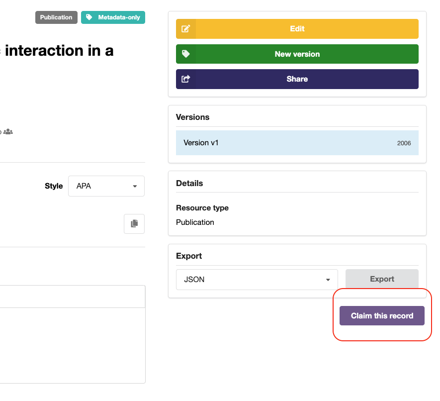
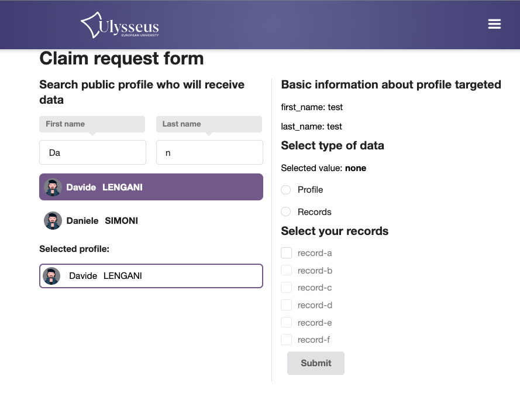

# Définitions
| Name               | Description                                                              |
|--------------------|--------------------------------------------------------------------------|
| user               | InvenioRDM user that can publish records or admin                        |
| adminProfilePublic | User with administration rights over a specific public profile           |
| globalAdmin        | User with administration rights allowing them to accept/reject claims    |
| claim              | Request from a user to claim administration rights over a public profile |
# Creation of Public Profiles
- An initial job will link records with public profiles based on first name and last name of the authors of the record.  
- Each InvenioRDM user can claim the administration rights for a public profile which has records associated. They can also request for the association or disassociation of a record with an existing public profile.  
- When a claim is accepted by a globalAdmin, the user gains admin rights over the profile or the claimed records become associated to an existing or a new public profile.  
- The administration relationship between users and public profiles is handled by the `ProfileUserAdministration` table.  
- The association relationship between records and public profiles is handled by the `ProfileToRecordAttribution` table.  
- A link to a claim form is available on each record and the form allows to target either the profile or the record.
## Class diagram

## User claims records for a target public profile
When a user claims one or more records and the request is approved by an admin, a claim request is generated. This involves inserting the request into the claim table with the following details:
- ID of the user making the claim request.
- List of claimed records.
- ID of the public profile that you want to remove the association to (optional)
- ID of the public profile that will receive the records if it's an existing record.
- Details of the new public profile that will receive the records in case a new profile shall be created.
Subsequently, for all records in the list, the `ProfileToRecordAttribution` table is updated by replacing the old public profile ID with the new one.  
If the old public profile has no longer any associated records, it is then deleted.

## User claims a public profile
When a user claims a public profile and the request is approved by an admin, a claim request is generated by inserting the request into the claim table. The request includes:
- ID of the user making the claim request.
- ID of the claimed public profile.
- ID of the public profile that will receive the records in case a merge is needed.
If a merge is needed, for all records associated with the claimed public profile, the `ProfileToRecordAttribution` table is updated by replacing the claimed public profile ID with the merged public profile. The claimed public profile is then deleted.

## Claim details
A claim is filed in database with the following information:

| Colonne                               | Données                                                                               |
|---------------------------------------|---------------------------------------------------------------------------------------|
| user_id                               | Invenio user id of the requester                                                      |
| recordList[]                          | List of requested records                                                             |
| claim_message                         | Reason for request (option)                                                           |
| receiver_profile_id                   | ID of the public profile receiving the records                                        |
| receiver_profile_details              | Details of the public profile receiving the records in case of creation               |
| current_public_profile                | ID of the public profile loosing the records                                          |
| current_public_profile_admin_decision | JSON -> Approval/rejection and reason for approval from existing public profile admin |
| global_admin_decision                 | JSON -> Approval/rejection and reason for approval from global admin                  |

# UI modifications
Creation of a "Claim" button for records, accessible only when the user is logged in. This button will direct users to a form page where they can choose to claim either a single profile or multiple records. Additionally, the form should incorporate a description field to assist the administrator in making decision.

Here are draft screens of how the claim process could look like.  
First the claim form:

the chois of the receiver profile:

Creation of a page for visualizing ongoing claim requests.  
Within the requests section, include a "Pending Claims" tab that comprises a table displaying all pending claim requests.

